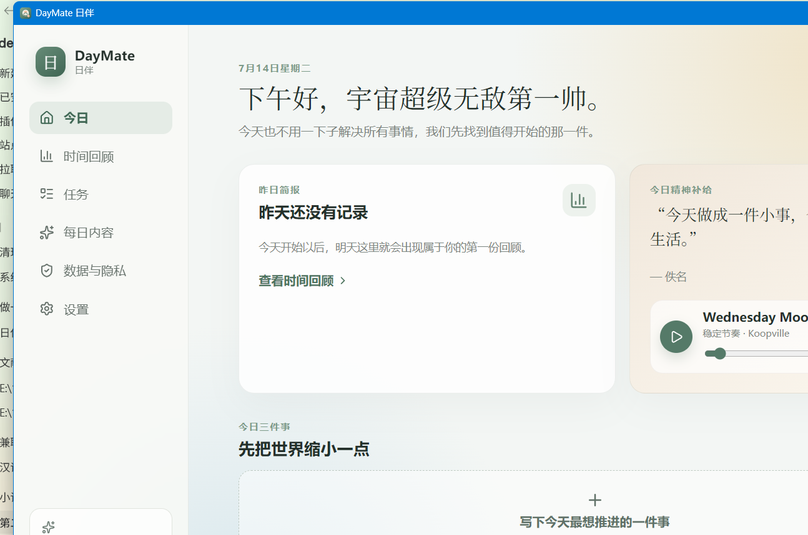
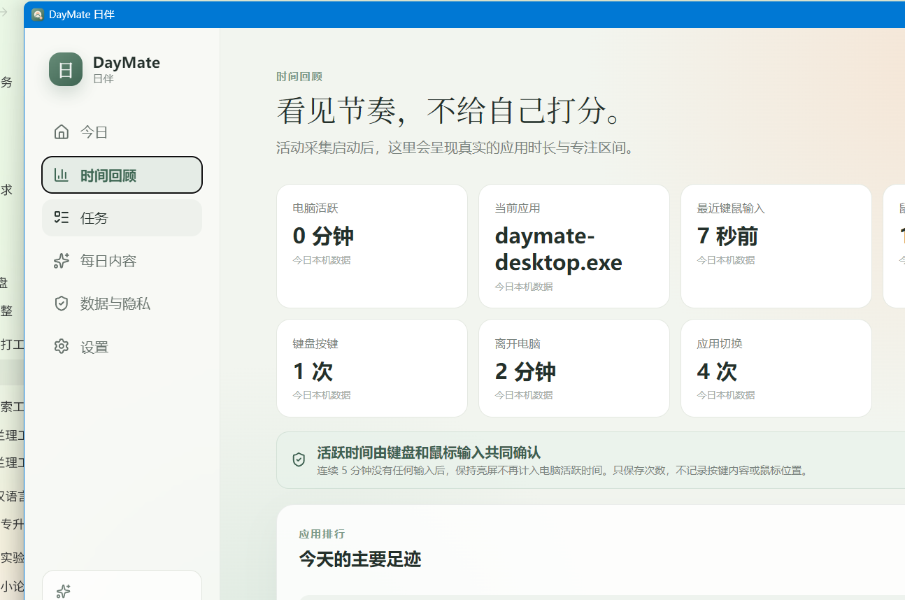

<p align="center">
  
</p>

# DayMate 日伴

> 每天开机，陪你回顾昨天、安排今天，也给生活添一点乐趣。

DayMate 是一款 Windows 优先、本地优先的桌面陪伴应用。它不是企业监控软件，也不是要求用户维护复杂清单的项目管理工具。它只想帮用户看见昨天、选出今天最值得做的一件事，并更轻松地开始。

当前版本：`0.4.0`（MVP 开发版）

[⬇️ 直接下载 DayMate 0.4.0 Windows 安装包](https://github.com/zhangweiguo9719-web/daymate-desktop/releases/download/v0.4.0/DayMate_0.4.0_x64-setup.exe) · [查看最新版本](https://github.com/zhangweiguo9719-web/daymate-desktop/releases/latest) · [中文使用手册](USER_GUIDE.md)

## 已实现

- 五步首次引导：昵称、身份、陪伴语气、隐私说明、第一项任务
- 今日首页：问候、今日三件事、规则选任务、每日精神补给
- 任务：新增、完成、删除、优先级、预计时间、截止日期
- 专注模式：倒计时、暂停/继续、提前完成
- 每日内容：好句、应用内智能音乐、轻松一刻、微挑战；音乐与其他卡片独立切换
- 音乐偏好与搜索：智能、专注、国风民乐、古典、自然、电子六类，支持本地歌曲导入
- 播放控制：随机推荐、自动连播、顺序播放、单曲循环；切换页面或收起窗口后继续播放
- 浮动球播放律动，以及托盘/浮动球原生右键退出菜单
- 键鼠活跃判断：展示鼠标点击、键盘按键和最近输入时间，避免亮屏造成使用时长误判
- 应用级时间分析：真实程序图标、全部应用停留时长与占比、横向排行图和环形分布图
- 四首 CC0 音乐随应用离线提供，网络曲库不可用时也能播放
- 每日舒适背景：七套柔和渐变按日期稳定轮换，也可随时手动换景
- 多 AI 服务商设置与连接测试；API Key 安全保存到 Windows 凭据管理器
- 隐私控制：活动记录、窗口标题、空闲检测开关和二次确认删除
- Windows 活动采集后端：前台进程、可选窗口标题、5 分钟空闲排除、60 秒批量落库
- SQLite 数据库：WAL、迁移记录、会话索引、今日统计查询
- 系统托盘基础入口
- 可拖动桌面浮动球：收起主窗口后常驻桌面，点击恢复
- 深浅主题、本地状态持久化、前端测试、版本一致性检查

## 应用截图






## 技术栈

| 层         | 技术                                         | 用途                                                         |
| ---------- | -------------------------------------------- | ------------------------------------------------------------ |
| 桌面容器   | Tauri 2                                      | 窗口、托盘、安装包、Rust 命令桥接                            |
| 前端       | React 19 + TypeScript + Vite 7               | 页面和交互                                                   |
| 状态       | Zustand                                      | 用户设置与任务状态，本地持久化                               |
| UI         | 原生 CSS + Lucide React                      | 轻量界面与图标                                               |
| 桌面后端   | Rust + Windows Icons                         | Windows 活动采集、本机程序图标提取、隐私边界、数据库         |
| 本地数据库 | SQLite / rusqlite                            | 应用使用会话与迁移记录                                       |
| 音乐       | Audius API + CC0 本地曲库 + HTML Audio       | 大型开放音乐目录搜索、应用内流式播放、离线兜底与 AI 场景推荐 |
| AI 接口    | OpenAI 兼容协议 + Windows Credential Manager | 多平台配置、连接测试和密钥隔离                               |
| 校验测试   | TypeScript、ESLint、Vitest、Clippy           | 类型、规则和构建质量                                         |
| 发布       | GitHub Actions + GitHub Releases             | Tag 触发 Windows 构建和发布                                  |

## 架构

```text
React UI
  ├─ 今日 / 任务 / 专注 / 每日内容 / 每日背景
  ├─ 主窗口 / 可拖动桌面浮动球
  ├─ Zustand：任务与用户偏好
  └─ native.ts：唯一 Tauri 调用边界
             │ invoke
Rust / Tauri ├─ Windows 前台应用与空闲检测
             ├─ AI 密钥系统凭据存储与连接测试
             ├─ 60 秒内存聚合，避免高频写盘
             └─ SQLite：app_usage_sessions + migration_history
```

关键设计说明见 [docs/architecture.md](docs/architecture.md)，隐私边界见 [PRIVACY.md](PRIVACY.md)。

## 项目目录

```text
daymate-desktop/
├─ src/                  # React 前端
│  ├─ data/              # 本地每日内容
│  ├─ App.tsx            # 页面和核心交互
│  ├─ store.ts           # 状态与选任务规则
│  └─ native.ts          # Tauri 命令适配层
├─ src-tauri/            # Rust 桌面后端
│  ├─ src/lib.rs         # 数据库、活动采集、命令、托盘
│  └─ tauri.conf.json    # 窗口和安装包配置
├─ docs/                 # 架构、开发、发布说明
├─ scripts/              # 版本一致性检查
├─ .github/workflows/    # CI 与 Release
└─ CHANGELOG.md          # 正式更新纪要
```

## 本地运行

普通前端预览（不采集系统活动）：

```powershell
npm install
npm run dev
```

完整桌面模式：

```powershell
npm install
npm run desktop:dev
```

Windows 构建需要 Node.js、Rust MSVC 工具链、Visual Studio C++ Build Tools、Windows 10/11 SDK 和 WebView2。详见 [docs/development.md](docs/development.md)。

## 检查命令

```powershell
npm run lint
npm run typecheck
npm run test
npm run build
npm run version:check
cargo fmt --manifest-path src-tauri/Cargo.toml --all -- --check
cargo clippy --manifest-path src-tauri/Cargo.toml -- -D warnings
cargo test --manifest-path src-tauri/Cargo.toml
```

## 构建安装包

```powershell
npm run desktop:build
```

成功后产物位于：

```text
src-tauri/target/release/bundle/nsis/
```

普通用户不需要安装 Node.js 或 Rust，只需从 GitHub Releases 下载 `setup.exe` 安装包。

## GitHub 发布

1. 把所有用户可见修改写入 `CHANGELOG.md` 的 `[Unreleased]`。
2. 发布时移动到版本段，并同步三个版本号。
3. 合并到 `main`，创建并推送 `vX.Y.Z` Tag。
4. GitHub Actions 自动测试、构建并创建 Release。

完整流程见 [docs/release.md](docs/release.md)。

## 隐私承诺

- 默认记录应用名称和活跃时长；窗口标题默认关闭。
- 不记录键盘输入、不截屏、不读取聊天与文档正文。
- 活动数据默认只保存在本机 SQLite。
- AI Key 只保存在 Windows 凭据管理器；普通配置中不保存或回显完整密钥。
- 智能音乐会向 Audius 发送通用场景词或用户主动输入的搜索词并直接加载所选音频，不发送任务标题或活动明细。
- 本仓库附带的 D 盘启动脚本把开发数据保存到 `D:\DayMate\data`；正式安装版默认遵循系统应用数据目录。
- 当前 MVP 不包含账号、云同步或活动数据上传。
- 所有记录开关可关闭，活动数据可删除。

## 当前边界

- 当前优先支持 Windows 10/11。
- 任务与偏好当前由 WebView 本地存储保存；活动记录使用 SQLite。后续版本会统一迁移至 SQLite。
- 开机自启和桌面通知设置已保留 UI，正式发布前需要接入并完成 Windows 实机验证。
- AI 自然语言总结尚未接入业务页面；v0.2.0 已完成多平台安全配置和连接基础。

## 开源协议

[MIT](LICENSE)
